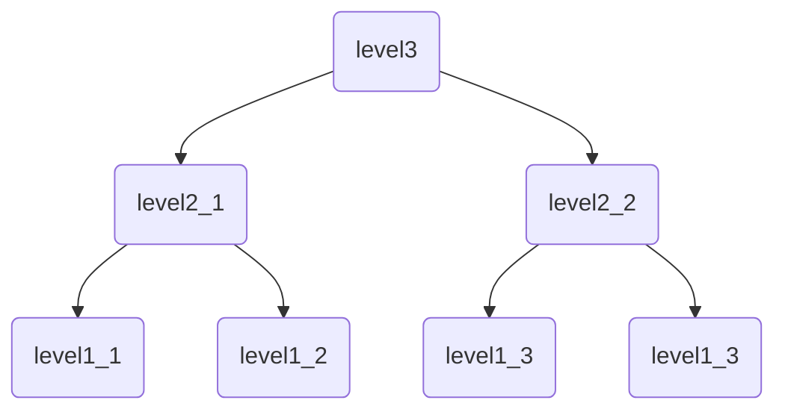

R-Tree

## 认识R-Tree

B-Tree[^1]的搜索本质是一维区间的划分过程，每次搜索节点就是一个子区间。

R-Tree是把B-Tree的思想拓展到多维空间，采用了B-Tree分割空间的思想，是一棵用来存储高维数据的平衡树[^2]。

对于R-Tree来说，叶子结点所在层级称为`level 1`,根结点所在层级称为`level h`,R-tree满足以下性质：

1. 所有非根节点包含`m`-`M`个记录索引（条目）。根结点的记录数可以小于`m`。通常 m= $\frac{M}{2}$
1. 每一个非叶子结点的分支数和该节点内的条目相同，一个条目对应一个分支，所有叶子节点都位于同一层，因此R-Tree为平衡树
1. 叶子结点的每一个条目表示一个点
1. 非叶子结点的每一个条目存放的数据结构为：`(I,child-pointer)`。`child-pointer`是指向该条目对应孩子节点的指针，`I`表示一个n维空间的最小矩形边界`(minimum bounding rectangle 即 MBR)`，`I`覆盖了该条目对应子树中所有的矩形或点

[^1]:https://en.wikipedia.org/wiki/B-tree
[^2]:**平衡树**是计算机科学中的一类数据结构，为改进的二叉查找树。一般的二叉查找树的查询复杂度取决于目标结点到树根的距离（即深度），因此当结点的深度普遍较大时，查询的均摊复杂度会上升。为了实现更高效的查询，产生了**平衡树**。在这里，平衡指所有叶子的深度趋于平衡，更广义的是指在树上所有可能查找的均摊复杂度偏低。

